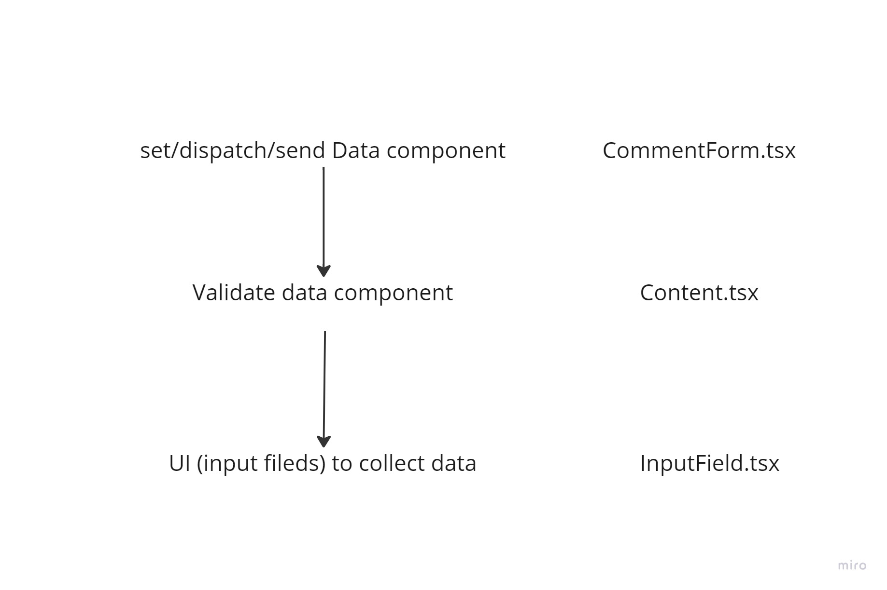

## JUBIC FORM

#### Prerequisites:
    Remember to "npm install" for the node_modules folder
#### Configurations: 
    Nope
#### How to run the project?
    In production mode: npm run build
    In development mode: npm start
    In test mode: npm test

#### Description: 
    This project is mainly add/delete a blog which includes : author, description, and comment.
#### Technologies: 
    "@mui/material": to create some features, like modal or input fields.
    "@mui/icons-material": for the icons.
    "react-hook-form": to control and manage the form.
    "yup": to validate input fields.
    "react-redux": to share states in global and manage them.
    "react-toastify": to notify a message after user add/delete.

1. DOM tree

2. UI design

3. Form management

4. Redux workflow

- Adding a new blog:

- Delete a blog: 

